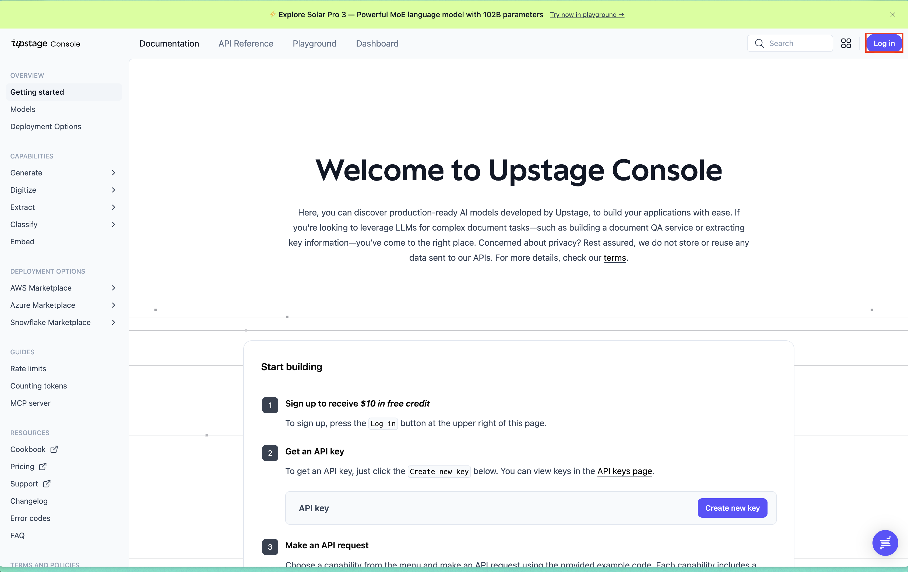
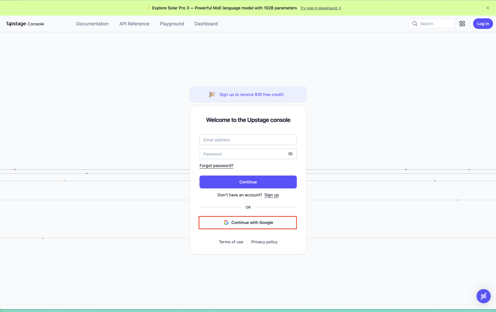

# 지식 증류(Distillation)와 Pseudo labeling

Teacher Model(거대 모델)의 윤리적 판단 기준과 지식 등을 Student Model(소형 모델)에 이식(Distillation)하는 방법론인 지식 증류(Knowledge Distillation) 방법론들 중에서 학습 데이터를 Teacher Model로 생성하여 Student Model의 학습에 사용하는 Pseudo Labeling 방법론을 이용합니다. Pseudo Labeling 방법론은 정답이 없는 데이터에 Teacher Model이 생성한 정답 데이터를 만들고 그 정답 데이터가 실제 정답 데이터(gold)라고 가정합니다. Teacher Model이 생성한 정답이기 때문에 Teacher Model과 유사한 분포를 학습을 통해서 얻을 수 있습니다.

## 프로젝트 목표

1. 실습명 : Knowledge Distillation을 위한 LLM 기반 Pseudo labeled 데이터 생성
2. 핵심 주제:
    1. API 셋팅
    2. 데이터 불러오기
    3. 프롬프트 엔지니어링
    4. LLM을 이용한 Pseudo Labeling
3. 학습 목표 :
    1. Teacher 모델(LLM)로 사용할 Upstage Solar를 셋팅할 수 있다.
    2. 미리 저장된 데이터셋을 불러올 수 있다.
    3. LLM을 이용한 Knowledge Distillation을 위해 프롬프트 엔지니어링을 진행할 수 있다.
    4. LLM을 이용하여 Pseudo Labeling을 할 수 있다.
4. 학습 개념: 키워드명 :
    1. LLM
    2. Prompt Engineering
    3. Pseudo Labeling
5. 학습 방향 :
  - 로컬에서 돌리기 어려운 parameter size의 거대 모델을 API를 이용해서 불러와 Pseudo Labeling을 진행하여 학습 데이터를 준비합니다.
  - 실습 코드는 조교가 직접 구현한 코드를 참고하여 학습합니다.
  - 해당 실습은 데이터가 있긴 하지만 정답 데이터가 없는 상황을 어떻게 하면 해결할 수 있을지 고민합니다.


## 사전 요구사항

-   **Python**: 3.13 (microsoft store에서 제공하는 python 버전)
-   **RAM**: 최소 8GB
-   **저장공간**: 최소 2GB
-   **운영체제**: Windows 10/11

## 프로젝트 구조

```text
.
├── assets                          # 이미지
├── data                            # 학습 데이터
├── LLM_기반_데이터_생성.ipynb          # 학습 관련된 코드드
└── pyproject.toml                  # 의존 패키지 버전 명시
```

## 시작하기

### 1. 환경 설정
1. `cd 커맨드 사용 시, 본인이 압축을 푼 디렉토리로 이동해야 합니다.`

2. uv가 설치되어 있어야 합니다. uv를 설치하는 방법은 [uv 설치](https://www.notion.so/ssunbell/uv-2101806f5bc180cca089d25f0acb24e3?source=copy_link)를 참고하세요.

3. `uv sync` 명령어로 가상환경을 설치 및 라이브러리 설치를 진행합니다. uv sync 명령어 이후 `.venv` 폴더가 생성된 것을 확인하실 수 있습니다.
```bash
uv sync
```

- 만약 이슈가 있다면 아래 명령어를 참고해서 라이브러리를 설치를 진행해주세요.
```bash
uv add dotenv==0.9.9 openai==1.100.0 pandas==2.2.3 jupyter==1.1.1 ipykernel==7.1.0
```

4. `uv run main.py` 명령어 등 uv의 명령어를 사용하는 것이 익숙하지 않을 수 있습니다. 가상환경을 활성화하면 일반적인 `python main.py` 명령어로 코드를 동작시킬 수 있습니다. 단, `python3 main.py` 명령어는 로컬 python으로 경로가 설정되어 있으므로 라이브러리가 제대로 설치가 안되어 있어 동작하지 않을 수 있습니다.

   **Windows에서 가상환경 활성화 방법:**
   
   - **PowerShell**:
   ```powershell
   .venv\Scripts\Activate.ps1
   ```
   또는
   ```powershell
   . .venv\Scripts\Activate.ps1
   ```
   
   - **CMD (명령 프롬프트)**:
   ```cmd
   .venv\Scripts\activate.bat
   ```
   
   - **Git Bash**:
   ```bash
   source .venv/Scripts/activate
   ```
   
   > **참고**: PowerShell에서 실행 정책 오류가 발생하는 경우, `Set-ExecutionPolicy -ExecutionPolicy RemoteSigned -Scope CurrentUser` 명령어로 실행 정책을 변경하거나 관리자 권한으로 실행하세요.

### 2. Solar API 발급
Solar API 발급은 [Upstage Console](https://console.upstage.ai/docs/getting-started)에서 발급이 가능합니다.





### 3. 데이터 생성

데이터 생성과 관련된 내용은 `LLM_기반_데이터_생성.ipynb`의 셀을 실행하면서 학습하게 됩니다. 

## 문제 해결
-   **의존성 설치 오류**: python에서 문제가 발생한다면 microsofts store에서 python은 3.13 버전 이상을 설치를 해주세요.

-   **uv 명령어 인식 안 됨**: uv 설치 후 PowerShell에서 명령어가 인식되지 않는 경우, 다음 방법을 시도해보세요:
    
    1. **현재 세션에서 PATH 새로고침** (PowerShell에서 실행):
    ```powershell
    $env:Path = [System.Environment]::GetEnvironmentVariable('Path','Machine') + ';' + [System.Environment]::GetEnvironmentVariable('Path','User')
    ```
    
    2. **PATH에 직접 추가** (임시 해결):
    ```powershell
    $env:Path += ";$env:USERPROFILE\.local\bin"
    ```
    
    3. **영구적으로 PATH 추가** (관리자 권한 PowerShell):
    ```powershell
    $uvPath = "$env:USERPROFILE\.local\bin"
    $currentPath = [Environment]::GetEnvironmentVariable("Path", "User")
    if ($currentPath -notlike "*$uvPath*") {
        [Environment]::SetEnvironmentVariable("Path", "$currentPath;$uvPath", "User")
    }
    ```
    4. **PowerShell 재시작**: 위 방법들을 시도한 후 PowerShell을 재시작하면 `uv` 명령어가 정상적으로 작동합니다.
    5. 그럼에도 안된다면 아래 명령어를 실행해주세요.
    ```powershell
    $uvPath = "$env:USERPROFILE\.local\bin"

    # User PATH에 추가
    $userPath = [Environment]::GetEnvironmentVariable("Path","User")
    if ($userPath -notlike "*$uvPath*") {
    [Environment]::SetEnvironmentVariable("Path", ($userPath.TrimEnd(";") + ";" + $uvPath), "User")
    }

    # 현재 세션 PATH 갱신
    $env:Path = [Environment]::GetEnvironmentVariable("Path","User") + ";" +
                [Environment]::GetEnvironmentVariable("Path","Machine")

    ```
    
    6. git bash를 사용할 경우 `curl -LsSf https://astral.sh/uv/install.sh | sh`를 사용해주세요.

-   **크레딧 오류**: reasoning 모델을 사용하는 프로젝트이므로 크레딧이 빠르게 소진됩니다. 만약, 크레딧이 너무 많이 소진된다고 판단되면 solar-pro2로 진행해주시길 바랍니다.
    

## 참고 문헌
-   **[Upstage Console](https://console.upstage.ai/docs/getting-started)**
