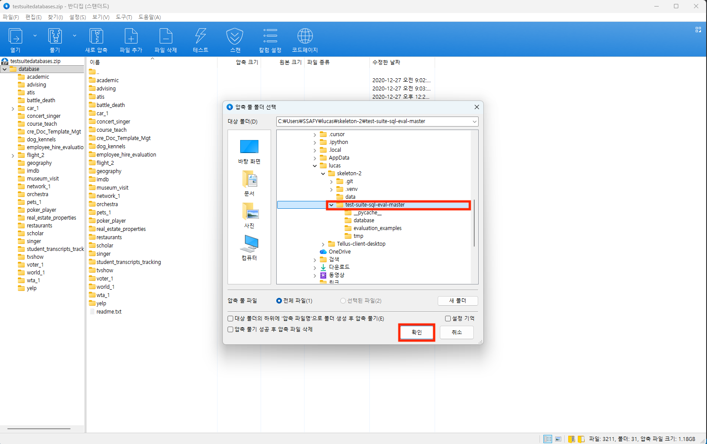

# Quantization과 QLoRA

양자화(Quantization)는 모델의 자료형을 4-bit 등으로 만들어서 모델을 가볍게 만드는 작업을 의미합니다. fp16의 자료형에서 4-bit의 자료형으로 만들면 용량이 4배 가벼워지고 모델 size가 4배 줄어들지만, 그만큼 성능은 하락할 수 밖에 없습니다. 양자화는 성능을 높이기 위한 방법론이 아닌 성능을 최대한 유지하면서 모델 사이즈를 줄이는 방법론입니다. 이러한 방법론을 이용하여 모델을 4-bit로 만들어서 LoRA 학습을 진행하는 QLoRA에 대해서 학습해봅니다.

## 프로젝트 목표

1. 실습명 : QLoRA로 모델을 양자화해서 학습하기기
2. 핵심 주제:
    1. 데이터셋 불러오기
    2. base 모델 4 bit 양자화 및 토크나이저 불러오기
    3. Text-to-SQL task 모델 QLoRA fine-tuning
3. 학습 목표 :
    1. Text-to-SQL task 학습을 위한 4 bit base 모델 및 토크나이저를 불러올 수 있다.
    2. base 모델에 QLoRA를 이용하여 4-bit 양자화 fine-tuning을 진행할 수 있다.
4. 학습 개념: 키워드명 :
    1. bitsandbytes
    2. 4-bit
    3. QLoRA fine-tuning
5. 학습 방향 :
  - 양자화라는 개념을 이해하고 이를 통해 모델의 성능 하락을 최소화하면서 모델을 학습합니다.
  - 실습 코드는 조교가 직접 구현한 코드를 참고하여 학습합니다.
  - 해당 실습은 모델을 학습시킬 경우 무엇이 필요하고 어떻게 하면 학습을 효율적으로 할 수 있는지 고민해봅니다.

## 사전 요구사항

-   **Python**: 3.13 (microsoft store에서 제공하는 python 버전)
-   **GPU**: 12.9.1 버전 CUDA (최소 6GB VRAM 권장)
-   **RAM**: 최소 8GB
-   **저장공간**: 최소 2GB
-   **운영체제**: Windows 10/11

## 프로젝트 구조

```text
.
├── assets                          # 이미지
├── data                            # 학습 데이터
├── test-suite-sql-eval-master      # 평가 관련된 코드
├── QLoRA.ipynb                     # 학습 관련된 코드드
├── inference.py                    # 추론 스크립트
├── pyproject.toml                  # 의존 패키지 버전 명시
└── outputs                         # 학습한 모델들이 담기는 폴더
```

## 시작하기

### 1. 환경 설정
1. `cd 커맨드 사용 시, 본인이 압축을 푼 디렉토리로 이동해야 합니다.`

2. uv가 설치되어 있어야 합니다. uv를 설치하는 방법은 [uv 설치](https://www.notion.so/ssunbell/uv-2101806f5bc180cca089d25f0acb24e3?source=copy_link)를 참고하세요.

3. `uv sync` 명령어로 가상환경을 설치 및 라이브러리 설치를 진행합니다. uv sync 명령어 이후 `.venv` 폴더가 생성된 것을 확인하실 수 있습니다.
```bash
uv sync
```

- 만약 이슈가 있다면 아래 명령어를 참고해서 라이브러리를 설치를 진행해주세요.
```bash
uv add numpy==2.1.0 pandas==2.2.3 peft==0.17.1 torch==2.9.0 transformers==4.56.0 accelerate==1.10.1 datasets==4.0.0 trl==0.22.2 sqlparse==0.5.5 nltk==3.9.2 jupyter==1.1.1 ipykernel==7.1.0 bitsandbytes==0.49.1
```

4. `uv run main.py` 명령어 등 uv의 명령어를 사용하는 것이 익숙하지 않을 수 있습니다. 가상환경을 활성화하면 일반적인 `python main.py` 명령어로 코드를 동작시킬 수 있습니다. 단, `python3 main.py` 명령어는 로컬 python으로 경로가 설정되어 있으므로 라이브러리가 제대로 설치가 안되어 있어 동작하지 않을 수 있습니다.

   **Windows에서 가상환경 활성화 방법:**
   
   - **PowerShell**:
   ```powershell
   .venv\Scripts\Activate.ps1
   ```
   또는
   ```powershell
   . .venv\Scripts\Activate.ps1
   ```
   
   - **CMD (명령 프롬프트)**:
   ```cmd
   .venv\Scripts\activate.bat
   ```
   
   - **Git Bash**:
   ```bash
   source .venv/Scripts/activate
   ```
   
   > **참고**: PowerShell에서 실행 정책 오류가 발생하는 경우, `Set-ExecutionPolicy -ExecutionPolicy RemoteSigned -Scope CurrentUser` 명령어로 실행 정책을 변경하거나 관리자 권한으로 실행하세요.

### 2. 모델 훈련

모델 훈련은 `QLoRA.ipynb` 파일을 이용하여 진행합니다. 각 셀마다 설명이 포함되어 있기 때문에 해당 부분을 읽어가면서 진행해주시길 바랍니다.

### 3. 모델 평가

1. 아래 명령어를 실행하여 nltk에 필요한 데이터를 다운로드합니다.
```bash
python -c "import nltk; nltk.download('punkt_tab')"
```

2. 구글 드라이브 링크인 [데이터베이스](https://drive.google.com/file/d/1mkCx2GOFIqNesD4y8TDAO1yX1QZORP5w/view?usp=sharing)에서 데이터를 다운로드 받습니다. 받은 데이터는 `test-suite-sql-eval-master/database`에 넣습니다.





3. 아래 명령어를 이용해서 테스트를 진행해주세요.
- PowerShell
`cd test-suite-sql-eval-master; python evaluation.py --gold gold.txt --pred base_model_predict.txt --db database/ --etype exec --plug_value`

- Git Bash
`cd test-suite-sql-eval-master && python evaluation.py --gold gold.txt --pred base_model_predict.txt --db database/ --etype exec --plug_value`

명령어를 실행할 경우 
```bash
                     easy                 medium               all                  
joint_all
count                44                   16                   60                   
1
=====================   EXECUTION ACCURACY     =====================
execution            0.682                0.250                0.567
```
처럼 출력이 나와야 합니다.

4. 실제 모델을 학습했다면 `outputs/` 디렉토리 하위에 모델 파일이 저장됩니다. `python inference.py` 명령어를 실행하여 모델 추론을 진행하면 `test-suite-sql-eval-master` 디렉토리에 `pred.txt` 파일이 생성됩니다.

5. 아래  명령어를 이용해서 모델 추론을 돌리고 결과물을 확인해보세요.

- PowerShell
  - 현재 디렉토리가 `test-suite-sql-eval-master` 인 경우 : `python evaluation.py --gold gold.txt --pred predict.txt --db database/ --etype exec --plug_value`

- Git Bash
  - 현재 디렉토리가 `test-suite-sql-eval-master` 인 경우 : `python evaluation.py --gold gold.txt --pred predict.txt --db database/ --etype exec --plug_value`

## 문제 해결
-   **의존성 설치 오류**: python에서 문제가 발생한다면 microsofts store에서 python은 3.13 버전을 설치를 해주세요.

-   **uv 명령어 인식 안 됨**: uv 설치 후 PowerShell에서 명령어가 인식되지 않는 경우, 다음 방법을 시도해보세요:
    
    1. **현재 세션에서 PATH 새로고침** (PowerShell에서 실행):
    ```powershell
    $env:Path = [System.Environment]::GetEnvironmentVariable('Path','Machine') + ';' + [System.Environment]::GetEnvironmentVariable('Path','User')
    ```
    
    2. **PATH에 직접 추가** (임시 해결):
    ```powershell
    $env:Path += ";$env:USERPROFILE\.local\bin"
    ```
    
    3. **영구적으로 PATH 추가** (관리자 권한 PowerShell):
    ```powershell
    $uvPath = "$env:USERPROFILE\.local\bin"
    $currentPath = [Environment]::GetEnvironmentVariable("Path", "User")
    if ($currentPath -notlike "*$uvPath*") {
        [Environment]::SetEnvironmentVariable("Path", "$currentPath;$uvPath", "User")
    }
    ```
    4. **PowerShell 재시작**: 위 방법들을 시도한 후 PowerShell을 재시작하면 `uv` 명령어가 정상적으로 작동합니다.
    5. 그럼에도 안된다면 아래 명령어를 실행해주세요.
    ```powershell
    $uvPath = "$env:USERPROFILE\.local\bin"

    # User PATH에 추가
    $userPath = [Environment]::GetEnvironmentVariable("Path","User")
    if ($userPath -notlike "*$uvPath*") {
    [Environment]::SetEnvironmentVariable("Path", ($userPath.TrimEnd(";") + ";" + $uvPath), "User")
    }

    # 현재 세션 PATH 갱신
    $env:Path = [Environment]::GetEnvironmentVariable("Path","User") + ";" +
                [Environment]::GetEnvironmentVariable("Path","Machine")

    ```
    
    6. git bash를 사용할 경우 `curl -LsSf https://astral.sh/uv/install.sh | sh`를 사용해주세요.
    

## 참고 문헌
-   **[PEFT: Parameter-Efficient Fine-Tuning](https://github.com/huggingface/peft)** – Hugging Face.
-   **[Making LLMs even more accessible with bitsandbytes, 4-bit quantization and QLoRA](https://huggingface.co/blog/4bit-transformers-bitsandbytes)** - Hugging Face.